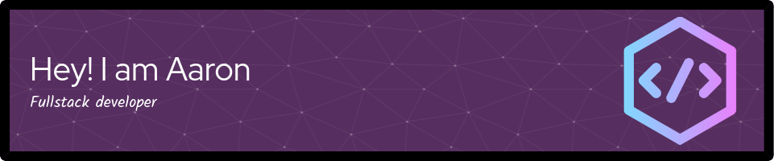

<h1 align="center"></h1>

<h1 align="center"></h1>

<table style="border: 0px">
  <td style="border: 0px">

    
 - 🔭 I’m currently working at [Acid Tango](https://acidtango.com/)

 - 📍 Located at the beautiful island of [Tenerife](https://www.google.com/maps/place/Santa+Cruz+de+Tenerife/@28.2836467,-16.6213036,11.25z/data=!4m13!1m7!3m6!1s0xc4029effe8682ed:0xb01a4bf1c84baf3c!2sTenerife!3b1!8m2!3d28.2915637!4d-16.6291304!3m4!1s0xc41cceccc254171:0x43111473d277e52e!8m2!3d28.4636359!4d-16.2518692) on Canary Islands, Spain.  

- 👨‍💻 Check my personal [portfolio](https://aaronperez.me)

- 🎮 I have a kind of diogenes syndrome on [Steam](https://steamcommunity.com/id/Molotroco)

- 📫 How to reach me [aarperper@gmail.com](mailto:aarperper@gmail.com)

- 📄 Know about my experiences on [Linkedin](https://www.linkedin.com/in/aarperper/)
  </td>
  <td>
    
  </td>
  </table>
<h3 align="left">Connect with me: </h3>

<h3 align="left">Skills & Interests: </h3>

  

<h3 align="center"></h3>

